This writeup provides a detailed guide on building a home SIEM (Security Information and Event Management) lab using Elastic and Kali Linux. The lab is designed to give you practical experience in SOC (Security Operations Center) analyst work, including setting up a SIEM, pushing telemetry, creating dashboards, and setting up alerts.

## Summary

This guide walks you through the process of setting up a home SIEM lab using Elastic and Kali Linux. The key steps include:
   - Setting up an Elastic Cloud account and deploying an Elastic instance.
   - Installing and configuring a Kali Linux VM in VirtualBox.
   - Installing the Elastic Agent on the Kali VM to push telemetry to the Elastic SIEM.
   - Generating security events using tools like `nmap` and analyzing them in the SIEM.
   - Creating dashboards and alerts in Elastic to visualize and detect security events.

## Tools/Blogs Used
- **Elastic Cloud**: Used for deploying the SIEM and managing telemetry.
- **VirtualBox**: Used for running the Kali Linux VM.
- **Kali Linux**: Used as the endpoint for generating security events.
- **Elastic Agent**: Used to push telemetry from Kali Linux to the Elastic SIEM.
- **nmap**: Used to generate security events for analysis.

## Lab Setup

### Prerequisites
Before getting started, ensure you have the following:

VirtualBox or VMware: For running the Kali Linux VM.

Basic knowledge of Linux and virtualization software: Familiarity with Linux commands and virtualization tools will be helpful.

### Step 1: Setting Up Elastic Cloud

1. **Create an Elastic Account**: 
   - Go to the [Elastic Cloud](https://cloud.elastic.co/) website and sign up for a free trial account.
   - No credit card is required for the trial.

2. **Create a Deployment**:
   - Once logged in, click on "Create Deployment."
   - Follow the prompts to set up your Elastic Cloud instance.

### Step 2: Setting Up Kali Linux VM

1. **Download VirtualBox**:
   - Download and install VirtualBox from the [official website](https://www.virtualbox.org/).

2. **Download Kali Linux VM**:
   - Download the Kali Linux VM from the [official Kali Linux website](https://www.kali.org/get-kali/).

3. **Install Kali Linux in VirtualBox**:
   - Open VirtualBox and click on "New" to create a new VM.
   - Select the Kali Linux ISO file you downloaded and follow the installation prompts.

4. **Launch Kali Linux**:
   - Once installed, launch the Kali Linux VM and ensure it has internet access.

### Step 3: Installing Elastic Agent on Kali Linux

1. **Add Elastic Defend Integration**:
   - In the Elastic Cloud console, go to the "Integrations" section and search for "Elastic Defend."

   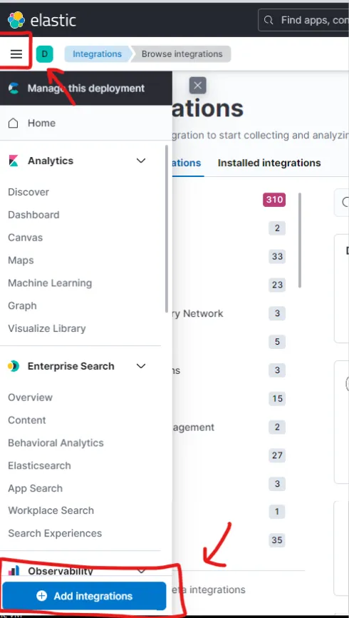

   - Click on "Add Elastic Defend" and configure the integration.

   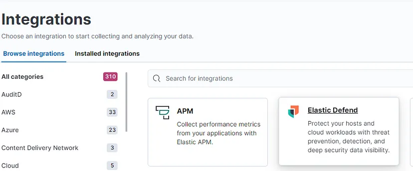

2. **Install Elastic Agent on Kali Linux**:

   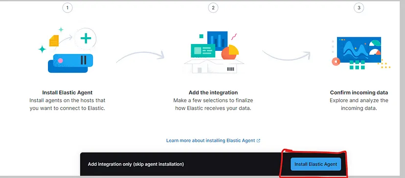

   - Copy the installation command provided in the Elastic Cloud console.

   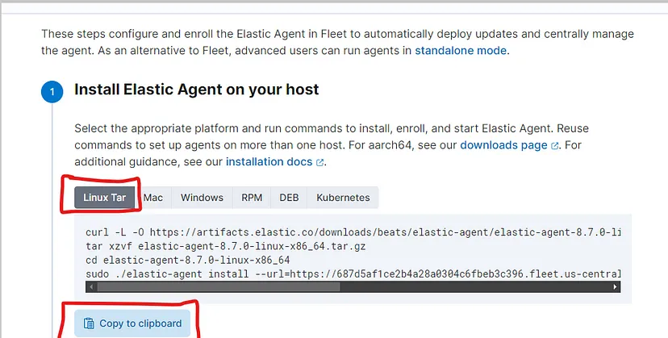

   - Open a terminal in Kali Linux and paste the command to install the Elastic Agent.

   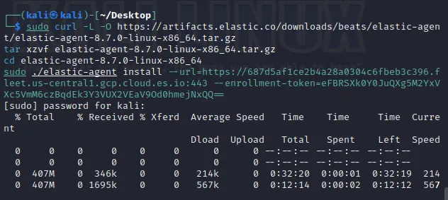
   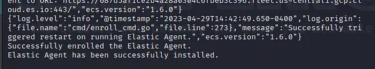

3. **Verify Installation**:
   - Run the following command to verify that the Elastic Agent is running:

     sudo systemctl status elastic-agent

   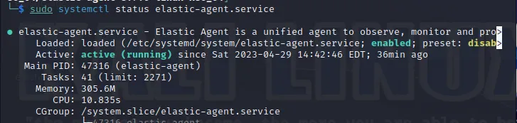

### Step 4: Generating Security Events

1. **Run nmap Scan**:
   - In the Kali Linux terminal, run an `nmap` scan on the localhost:
      sudo nmap localhost

   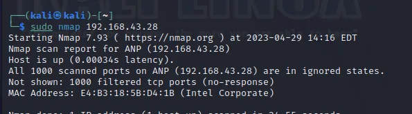

     nmap -p- -A localhost
     sudo nmap -sT localhost

   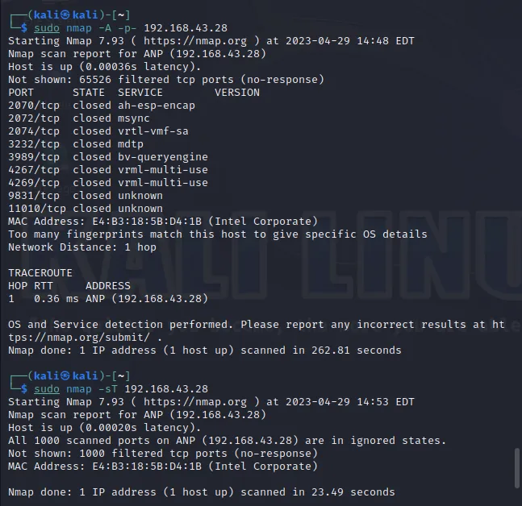

### Step 5: Analyzing Events in Elastic SIEM

1. **View Logs**:
   - In the Elastic Cloud console, go to "Observability" > "Logs" to view the telemetry data.

   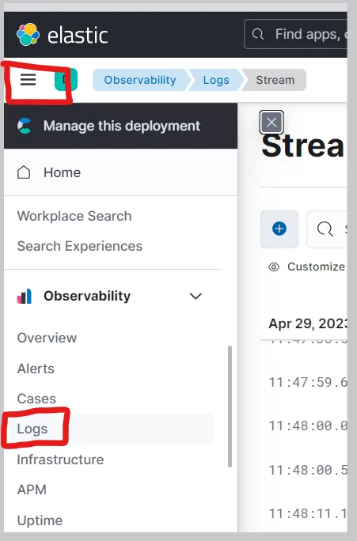

   Search for events related to `nmap` or other commands you ran.

   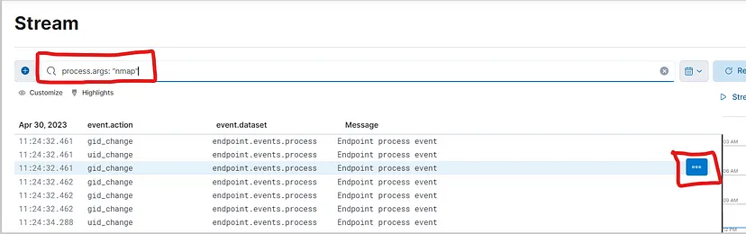
   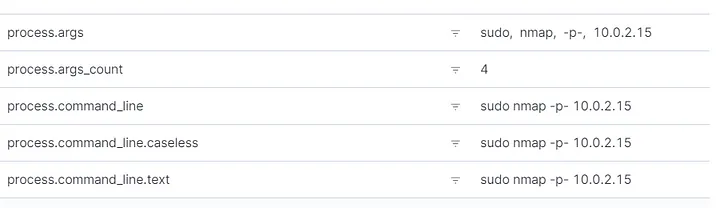

2. **Create a Dashboard**:
   - Go to "Analytics" > "Dashboard" and create a new dashboard.

   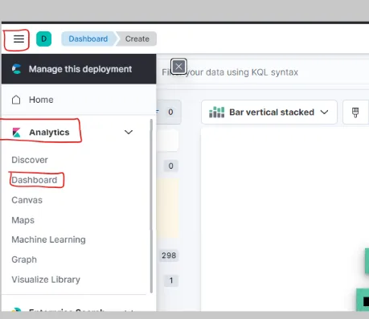

   - Click “Create Visualization” and select “Area” or “Line” chart.
   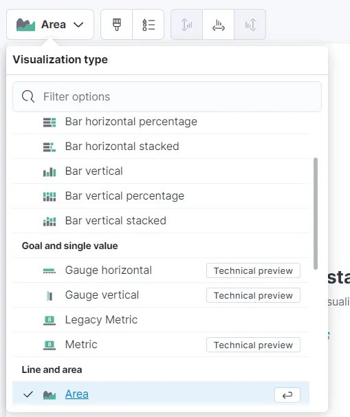
   
   - Configure the metrics:
      Vertical Axis: Count
      Horizontal Axis: Timestamp

   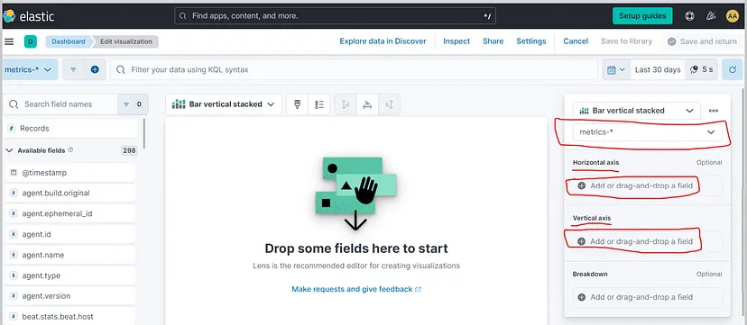
   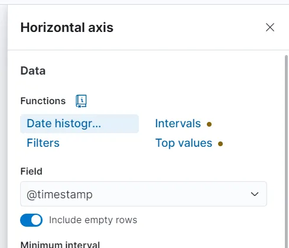
   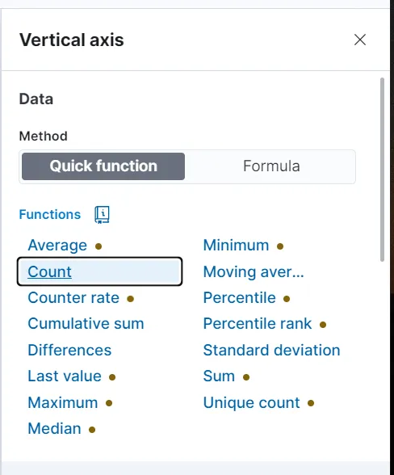
   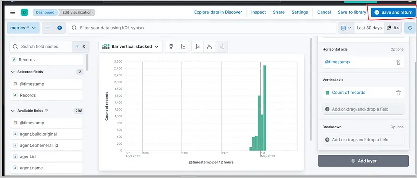

- Save the visualization and add it to a new or existing dashboard.

3. **Set Up Alerts**:
   - Go to "Security" > "Alerts" and create a new rule to detect `nmap` scans.

   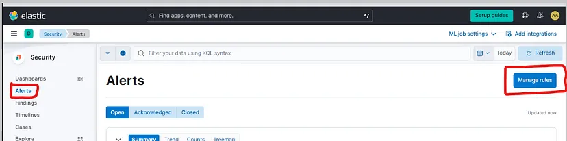

   - Configure the rule to send an email alert when an `nmap` scan is detected.

   Set the query to detect Nmap scans:
   

   Set the severity level and configure actions (e.g., email notifications or Slack messages).
   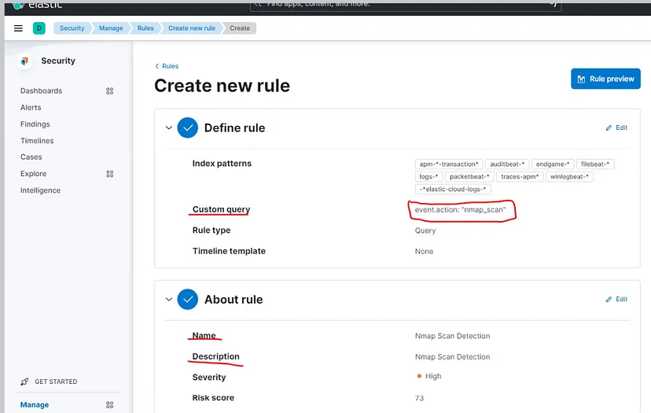
   
   Click “Create and Enable Rule” to activate the alert.
   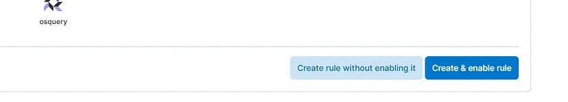

## Conclusion

By following this guide, you have successfully set up a home SIEM lab using Elastic and Kali Linux. You have learned how to push telemetry from a Kali VM to the Elastic SIEM, analyze security events, create dashboards, and set up alerts. This lab provides valuable hands-on experience for anyone looking to build skills in SOC analysis or blue team operations.

## Next Steps

- **Add More Agents**: Add more endpoints to your lab to simulate a more complex network environment.
- **Create More Dashboards and Alerts**: Experiment with creating additional dashboards and alerts to detect different types of security events.
- **Explore Advanced Features**: Dive deeper into Elastic's features, such as machine learning-based anomaly detection and threat hunting.

This lab is a great starting point for anyone looking to gain practical experience in SOC analysis and SIEM management. Keep experimenting and building on this foundation to further enhance your skills.

---

**References**:
- [Elastic Cloud](https://cloud.elastic.co/)
- [Kali Linux](https://www.kali.org/)
- [VirtualBox](https://www.virtualbox.org/)