# SOC141 — Phishing URL Detected**  

## **Triggered Alert**  
On **March 22nd**, an alert was triggered, indicating a **phishing URL** detected on the host system **EmilyComp** (IP: **172.16.17.49**). We will now claim the ticket and proceed with the investigation following our playbook.  
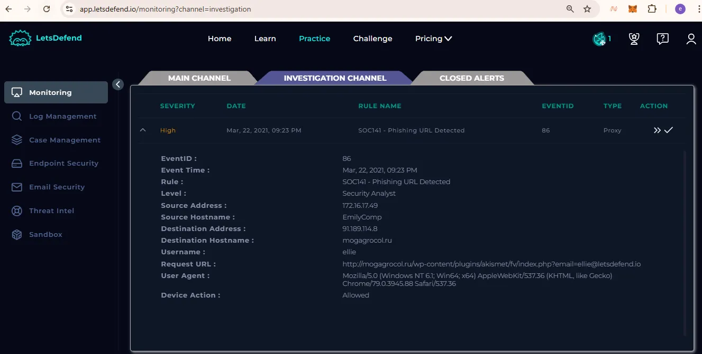

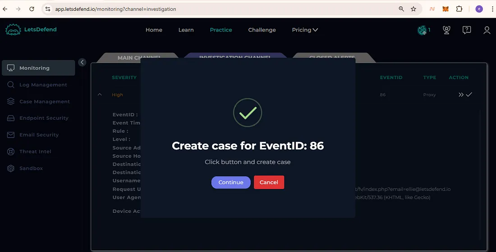

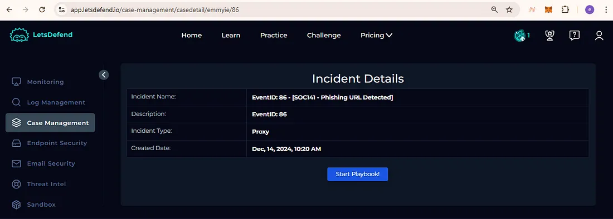

---

## **Playbook Investigation**  
Our investigation follows standard procedures, focusing on critical details:  

### **1. Source and Destination IP Analysis**  
- The **source IP (172.16.17.49)** is linked to **EmilyComp**.  
- The **destination IP (91.189.114.8)** requires further analysis using **VirusTotal** and **AbuseIPDB** to determine its reputation.  
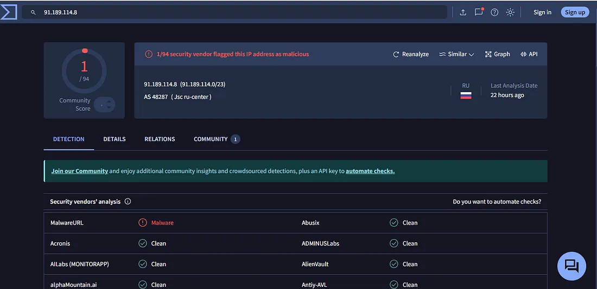

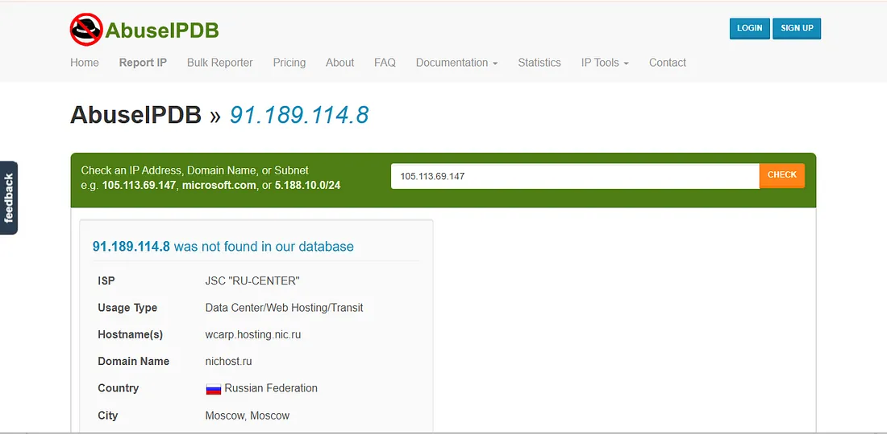

### **2. Threat Intelligence Reports**  
- **VirusTotal**: One security vendor has flagged the destination IP as **malicious**.  
- **AbuseIPDB**: The IP originates from **Russia**, raising further concerns.  
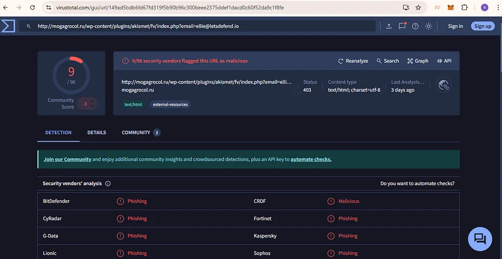

- Next, we investigate the **requested URL** for malicious activity.  
---

## **Malicious URL Confirmation**  
Reports confirm that the detected URL is indeed **malicious** and associated with **phishing campaigns**. This reinforces the need for deeper log analysis.  
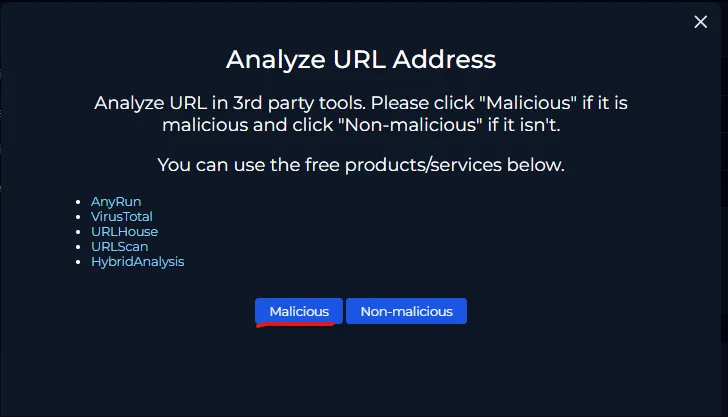

---

## **Log Analysis**  
Reviewing network logs, we identify **two instances** where the **malicious IP and URL** were accessed. Both requests originated from **EmilyComp (172.16.17.49)**, confirming that her device is the **only affected host**.  

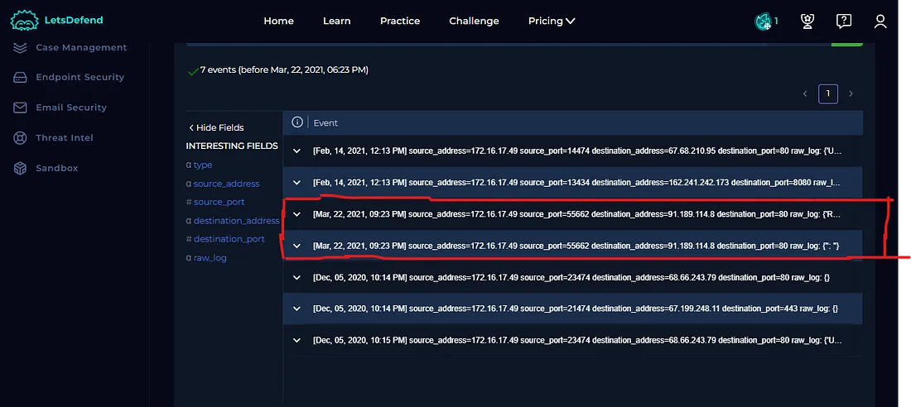

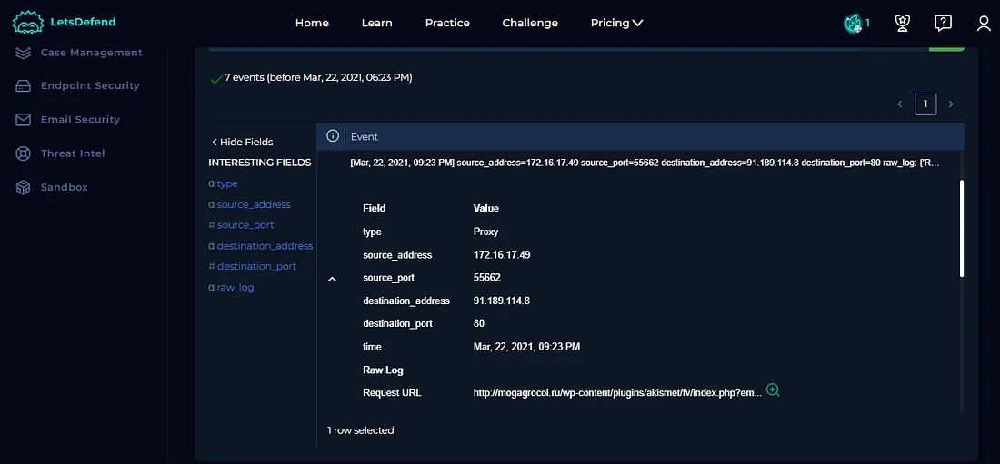

---

## **Mitigation Actions**  
To prevent further risk:  
1. **Isolate the affected host** via the **Endpoint Security** system.  
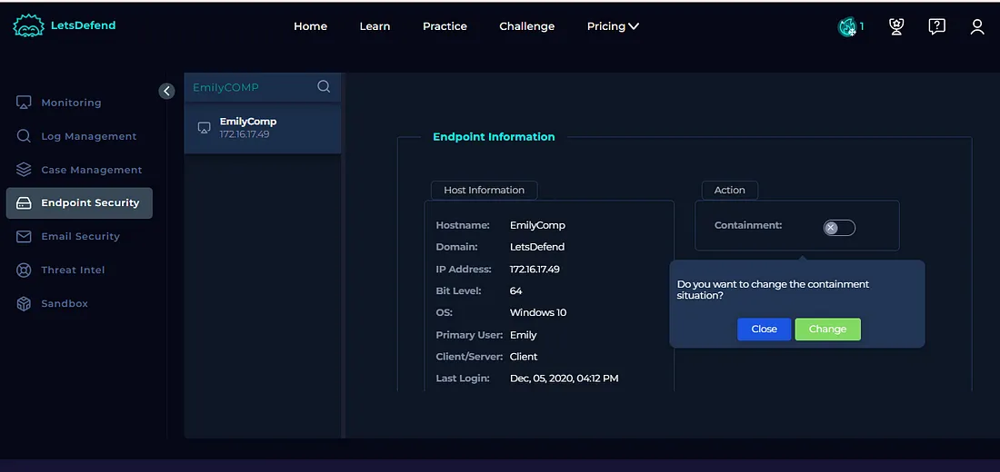

2. **Document findings** in the **Analyst Note** section.  
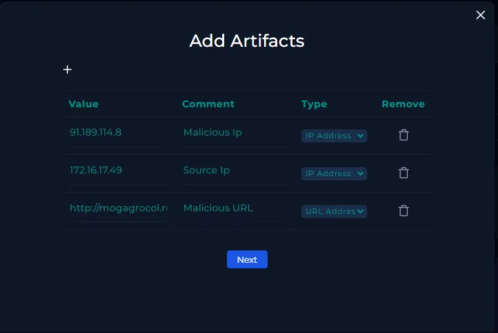

3. **Preserve artifacts** for further analysis.  
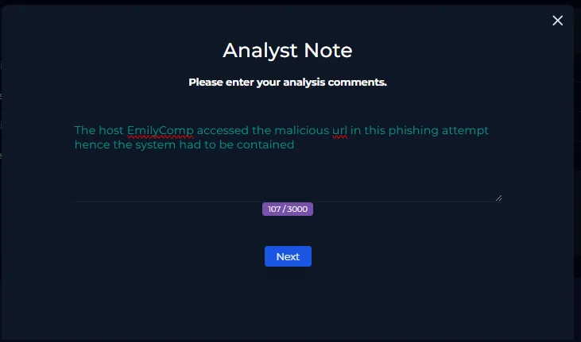

4. **Close the alert and update the playbook.**  
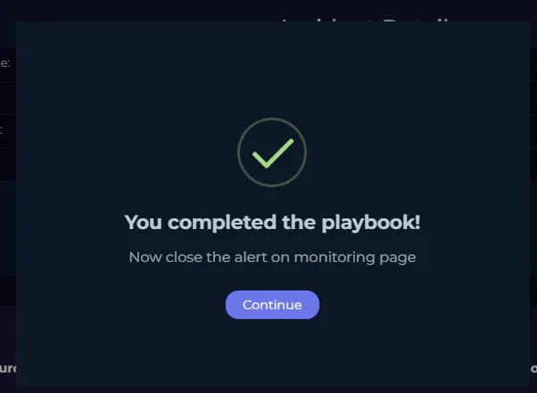

---

## **Phishing Prevention Best Practices**  
To reduce the risk of phishing attacks, individuals and organizations should:  

✅ **Enable Multi-Factor Authentication (MFA):** Adds an extra layer of security.  
✅ **Verify Links & Senders:** Double-check email addresses and URLs before clicking.  
✅ **Use Strong, Unique Passwords:** Avoid reuse and consider a password manager.  
✅ **Keep Software Updated:** Patches vulnerabilities that attackers exploit.  
✅ **Be Wary of Urgent Requests:** Avoid acting hastily on suspicious emails or messages.  

By following these precautions, we can strengthen defenses against phishing threats.  
