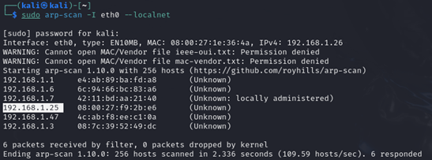

layout: single
title: MyExpense - Vulnhub
excerpt: "A walkthrough of the MyExpense Vulnhub machine, detailing the exploitation of XSS, CSRF, IDOR, and SQL Injection vulnerabilities to achieve the goal of getting an expense report approved."
date: 2024-07-27 # Update with the actual date
classes: wide
header:
  teaser: /blog/assets/images/vulnhub-myexpense-writeup/myexpense-logo.png # Replace with your actual teaser image path
  teaser_home_page: true
  icon: /blog/assets/images/vulnhub.png # Standard Vulnhub icon path
categories:
  - WriteUp
  - Vulnhub
---

 # Replace with your actual header image path

This write-up details the steps taken to exploit the MyExpense deliberately vulnerable web application. The scenario involves a former employee, Samuel Lamotte, hacking the internal expense reporting system to get his final expense report approved after being fired. The exploitation involves chaining multiple vulnerabilities including Cross-Site Scripting (XSS), Cross-Site Request Forgery (CSRF), Insecure Direct Object References (IDOR), and SQL Injection.

## Summary

This write-up covers the following phases of exploiting the MyExpense application:
   - **Scanning**: Identifying the target machine and open services using `arp-scan` and `nmap`.
   - **Enumeration**: Discovering the web application structure and user information using `dirb` and manual inspection. Identifying vulnerabilities like disabled inputs and user activation endpoints.
   - **Exploitation**:
      - Bypassing disabled form elements.
      - Performing XSS for cookie hijacking.
      - Executing CSRF to activate a user account.
      - Performing XSS again for session hijacking of a manager.
      - Discovering and exploiting IDOR.
      - Performing SQL Injection to extract credentials.
      - Logging in as different users to approve the expense report through the required workflow.
      - Retrieving the final flag.

## Tools/Concepts Used

- **`arp-scan`**: Used for discovering devices on the local network.
- **`nmap`**: Used for port scanning and service enumeration.
- **`dirb`**: Utilized for web directory and file brute-forcing.
- **Web Browser Developer Tools**: Employed to inspect and modify HTML elements (e.g., remove `disabled` attribute).
- **Python SimpleHTTPServer / http.server**: Used to host malicious scripts and receive exfiltrated data (cookies).
- **Cross-Site Scripting (XSS)**: Exploited for cookie hijacking and session hijacking.
- **Cross-Site Request Forgery (CSRF)**: Used to force an action (user activation) on behalf of an authenticated user.
- **Insecure Direct Object References (IDOR)**: Exploited to access unauthorized information by manipulating object identifiers in URLs.
- **SQL Injection (SQLi)**: Used to extract sensitive data (credentials) from the database.
- **MD5 Cracking** (Implied): Needed to crack the retrieved password hash.

## Phase 1: Scanning

Leveraging the company's Wi-Fi connection, the first step was to identify the target machine's IP address on the network.

Using `arp-scan`:

sudo arp-scan -I eth0 --localnet

Once the target IP (assumed 192.168.1.25 for this write-up) was identified, `nmap` was used to find open ports and services:

sudo nmap -sV -p- 192.168.1.25

The scan revealed Port 80 (HTTP) running an Apache server, indicating a web application interface.

## Phase 2: Enumeration

### Web Resource Enumeration

With the web server identified, `dirb` was used to discover files and directories:

dirb http://192.168.1.25

This scan found `robots.txt`, which revealed the path `/admin/admin.php`.

### Admin Interface and User Status

Accessing `http://192.168.1.25/admin/admin.php` showed a list of users. It was observed that the target user account, *samuel*, was marked as inactive.

A login button was present. Attempting to log in with Samuel's known credentials (`samuel/fzghn4lw`) failed due to the inactive account status.

Clicking the "inactive" status button next to Samuel's name revealed the URL used for activation:

http://192.168.1.25/admin/admin.php?id=11&status=active

Attempting to access this URL directly resulted in a permission denied error, as the current (unauthenticated or non-admin) user lacked the necessary privileges.

## Phase 3: Exploitation

### Step 1: Bypassing Registration & Initial XSS (Cookie Hijacking)

A "Don't have an account?" link led to a registration form. However, the "Signup" button was disabled.

Using the browser's developer tools, the `disabled` attribute was removed from the button, enabling registration.

A cookie exfiltration script was created

A new user was created, injecting an XSS payload into one of the fields (e.g., First Name or Last Name) designed to steal cookies:

A simple Python HTTP server was started on the attacker machine to receive the exfiltrated cookies:

# For Python 3.x
python3 -m http.server 80

When an administrator viewed the user list (which included the newly created user with the XSS payload), their cookies were sent to the attacker's listener.

One of the captured cookies belonged to the administrator (`rmasson`). Using this cookie allowed access to the admin account. However, the application seemed to enforce single sessions, preventing simultaneous use while the real admin might be active.

### Step 2: Activating 'samuel' via CSRF

Since direct activation failed and admin access was unstable, a CSRF attack was crafted. The goal was to make the administrator unknowingly trigger the activation URL for Samuel's account.

Another user was registered (or the previous payload modified) with a new XSS payload that contained an image tag whose `src` pointed to the activation URL:

When the administrator viewed the user list again, their browser executed the script, making a GET request to the activation URL with their admin session cookie. This successfully activated Samuel Lamotte's account.

### Step 3: Accessing as 'samuel' & Escalating to Manager (XSS Session Hijacking)

Login was now possible using Samuel's credentials (`samuel/fzghn4lw`).

Inside the application, Samuel's pending expense report for 750€ was found in the "My Expense Reports" section.

The report was submitted for validation.

The status changed to "submitted", indicating it needed manager approval. Samuel's profile or organizational chart revealed his manager was Manon Riviere.

To gain access to Manon's account, the internal chat feature was used to send another XSS payload. This payload referenced an external script (`script.js`) hosted on the attacker machine, designed to steal cookies.

When Manon viewed the chat, the script executed, sending her session cookie to the attacker's Python listener.

The captured cookie was used to hijack Manon Riviere's session. From her account, Samuel's expense report was located and validated.

The report status updated to "validated". A hint in the chat or application indicated the final status needed to be "sent for payment".

### Step 4: Escalating to Finance (IDOR & SQL Injection)

The next approver, likely responsible for finance, needed to be identified. Checking Manon Riviere's profile revealed her manager was Paul Baudouin.

It was assumed Paul Baudouin was not an active user of the chat or admin pages, making XSS impractical. Further enumeration was required.

An IDOR vulnerability was discovered. Accessing a URL like `http://192.168.1.25/site.php?id=2` displayed user information based on the `id` parameter.

This parameter was also vulnerable to SQL Injection. Union-based SQLi was used to extract information from the database.

List tables:

http://192.168.1.25/site.php?id=2 union select 1, (SELECT group_concat(table_name) FROM information_schema.tables WHERE table_schema = database()), 3, 4 #

List columns in the `user` table:

http://192.168.1.25/site.php?id=2 union select 1, (SELECT group_concat(column_name) FROM information_schema.columns WHERE table_schema = database() AND table_name = 'user'), 3, 4 #

Extract Paul Baudouin's password hash:

http://192.168.1.25/site.php?id=2 union select 1, (select password from user where username='pbaudouin'), 3,4;#

The query returned the MD5 hash: `64202ddd5fdea4cc5c2f856efef36e1a`. Cracking this hash revealed the password: **HackMe**.

### Step 5: Final Approval & Flag Retrieval

With Paul Baudouin's credentials (`pbaudouin/HackMe`), login to his account was successful.

From Paul's account, Samuel's expense report (now in "validated" state) was approved and sent for payment.

Finally, logging back into Samuel Lamotte's account (`samuel/fzghn4lw`) and checking the "My Expense Reports" section showed the report status as "sent for payment". The flag was displayed on the page.

## Conclusion

The MyExpense application was successfully exploited by chaining several common web vulnerabilities. Initial access and privilege escalation were achieved through XSS (cookie/session hijacking), CSRF (forcing actions), bypassing client-side controls (disabled buttons), IDOR (accessing unauthorized data), and finally SQL Injection (extracting credentials). This allowed navigating the multi-step approval workflow required by the scenario and ultimately retrieving the flag by getting the expense report fully approved.

## References:

- OWASP Top 10 (XSS, CSRF, SQLi, IDOR principles)  
- `arp-scan` manual  
- `nmap` documentation  
- `dirb` documentation  
- Python `http.server` documentation
